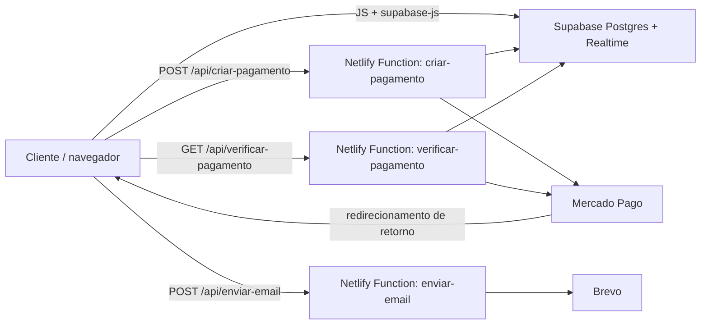

<p align="center">
  
</p>

# Faços

**Conecta clientes a profissionais de serviços domésticos e manutenção — limpeza, elétrica, hidráulica, jardinagem e mais — com busca por categoria, chat, agenda e pagamentos em um só lugar.**

[](index.html)
[](style.css)
[](script.js)
[](backend/supabase-schema-completo.sql)
[](netlify/functions/criar-pagamento.mjs)
[](netlify.toml)

O Faços tem duas frentes: o cliente busca um serviço por categoria, conversa com o profissional e acompanha pedidos e pagamentos; o profissional gerencia perfil, agenda, mensagens, notificações e carteira. Não há framework nem etapa de build — é HTML, CSS e JavaScript servidos como arquivos estáticos, com Supabase como banco de dados e autenticação própria, e Netlify Functions para as integrações que precisam de uma chave secreta (Mercado Pago e envio de e-mail).

O projeto está em desenvolvimento. Partes do fluxo — como saque da carteira do profissional e o mapa de atendimentos — ainda usam dados de exemplo ou placeholders. Veja [Segurança e limitações conhecidas](#segurança-e-limitações-conhecidas) antes de publicar uma cópia deste projeto, especialmente pelo estado das credenciais versionadas no repositório.

## Sumário

- [Funcionalidades e estado atual](#funcionalidades-e-estado-atual)
- [Tecnologias e arquitetura](#tecnologias-e-arquitetura)
- [Estrutura do repositório](#estrutura-do-repositório)
- [Instalação](#instalação)
- [Variáveis de ambiente](#variáveis-de-ambiente)
- [Supabase e schema](#supabase-e-schema)
- [Execução local](#execução-local)
- [Segurança e limitações conhecidas](#segurança-e-limitações-conhecidas)
- [Solução de problemas](#solução-de-problemas)
- [Contribuição e licença](#contribuição-e-licença)

## Funcionalidades e estado atual

| Área | Recursos presentes no código | Dependências e limites |
| --- | --- | --- |
| Contas | Cadastro de empresa (CNPJ) e profissional (CPF), login por aba, recuperação de senha por e-mail | Tabelas próprias `usuarios`/`profissionais` no Supabase; validação de CPF/CNPJ é só o cálculo de dígito verificador, sem consulta a nenhuma API externa |
| Landing e busca | Página pública (`index.html`), tela inicial logada com busca e estatísticas, 6 categorias de serviço (Limpeza, Eletricista, Casa e instalações, Manutenção, Jardinagem, Tecnologia e assistência) | Cada categoria consulta `profissionais` filtrando por `area_atuacao` e `status = 'ativo'` |
| Perfil do cliente | Perfil editável, histórico de pedidos com filtro por status | Tabelas `pedidos`; sem paginação além do que a listagem já carrega |
| Chat | Conversa cliente ↔ profissional em tempo real, badge de não lidas | Tabelas `conversas`/`mensagens_chat` com Supabase Realtime habilitado |
| Notificações | Sino de notificações e painel dedicado, também em tempo real | Tabela `notificacoes_app` com Realtime habilitado |
| Pagamentos (cliente) | Compra de crédito na carteira via Mercado Pago Checkout Pro, confirmação por retorno da URL | Netlify Functions `criar-pagamento`/`verificar-pagamento`; sem webhook do Mercado Pago — a confirmação depende do cliente voltar à página de retorno |
| Carteira do profissional | Extrato de ganhos/taxas, filtro por tipo | Botões de "Sacar via Mercado Pago" e "Transferir via Pix" exibem aviso de "em breve" — **não fazem saque real** |
| Área do profissional | Login próprio, dashboard com notificações recentes, agenda, mensagens, perfil, mapa de atendimentos | Mapa (Leaflet + OpenStreetMap) usa uma rota e coordenadas fixas de exemplo, não a localização real dos atendimentos |
| Assistente Buzz | Widget de chat flutuante presente na maior parte das telas | Respostas fixas pré-definidas no próprio `buzz.js` — não é integrado a nenhuma IA ou fila de atendimento humano |
| Internacionalização e tema | Alternância PT/EN e modo claro/escuro, com preferência salva por perfil (cliente/profissional) | Dicionários fixos em `Shared/i18n-cliente.js` e `Profissional/i18n.js`; cobrem parte das telas, não o site inteiro |
| E-mail | Envio de e-mail transacional (usado hoje na recuperação de senha) | Netlify Function `enviar-email` via Brevo; requer variáveis próprias configuradas |

## Tecnologias e arquitetura

| Camada | Tecnologias | Responsabilidade |
| --- | --- | --- |
| Interface | HTML5, CSS3, JavaScript (ES6+), sem framework nem bundler | Páginas por pasta/funcionalidade, uma dupla `.html`/`.css`/`.js` por tela |
| Dados e autenticação | Supabase (PostgreSQL), acessado direto do navegador via `@supabase/supabase-js` (CDN) | Persistência das tabelas de negócio; autenticação própria (não usa o Supabase Auth) com senha com hash SHA-256 (`CryptoJS`) no cliente |
| Tempo real | Supabase Realtime (channels/postgres_changes) | Chat, notificações e badge de não lidas |
| Funções serverless | Netlify Functions (`netlify/functions/*.mjs`) | Criação/verificação de pagamento no Mercado Pago e envio de e-mail via Brevo — os únicos pontos que usam uma chave secreta |
| Pagamentos | SDK REST do Mercado Pago (Checkout Pro) | Preferência de pagamento, retorno por URL e crédito de saldo na tabela `usuarios` |
| Mapas | Leaflet 1.9.4 + tiles OpenStreetMap (via CDN) | Mapa de atendimentos na área do profissional |
| Deploy | Netlify (`netlify.toml`, `_redirects`) | Publica a raiz do repositório como site estático e expõe as funções em `/api/*` |



Não há backend HTTP próprio em produção: o navegador fala diretamente com o Supabase usando a chave anônima, e só passa pelas Netlify Functions quando a operação exige uma chave secreta (Mercado Pago, Supabase service role ou Brevo). O arquivo `server.js` na raiz é um servidor Node simples usado como alternativa local antiga para testar a criação de preferência do Mercado Pago; não é o que roda em produção nem é iniciado pelas Netlify Functions.

## Estrutura do repositório

```text
Faços/
├── index.html                  # Landing page pública
├── script.js / style.css       # Script e estilo da landing page
├── netlify.toml                # Publica a raiz e aponta netlify/functions
├── _redirects                  # Regras de roteamento do Netlify (SPA-like)
├── server.js                   # Servidor Node local alternativo p/ testar Mercado Pago (não usado em produção)
├── .env                        # Variáveis usadas pelas Netlify Functions (ver aviso de segurança)
├── Auth/                       # Login e cadastro (empresa/profissional)
├── Landing Page/
│   ├── TelaIni.html/js/css     # Tela inicial logada do cliente, com busca e categorias
│   └── Perfil.html/js/css      # Perfil do cliente
├── Servicos/                   # Uma tela por categoria de serviço
│   ├── Limpeza.*
│   ├── Eletricista.*
│   ├── CasaInstalacoes.*
│   ├── Manutencao.*
│   ├── Jardinagem.*
│   └── TecnologiaAssistencia.*
├── Pedidos/                    # Histórico de pedidos do cliente
├── Pagamentos/                 # Compra de crédito (carteira) via Mercado Pago
├── Chat/                       # Chat cliente ↔ profissional (Supabase Realtime)
├── Notificacoes/               # Painel de notificações do cliente
├── Sino/                       # Componente de sino de notificações (embutido em várias telas)
├── Localizacao/                # Tela de localização/endereço do cliente
├── Buzz/                       # Widget de ajuda com respostas fixas
├── Shared/                     # i18n do cliente e badge de notificações compartilhado
├── Profissional/               # Área completa do profissional
│   ├── Login_profissional.html / login_profissional.*
│   ├── dashboard.*             # Painel inicial com notificações recentes
│   ├── agenda.*                # Agenda do profissional
│   ├── carteira.*              # Extrato de ganhos/taxas e ações de saque (placeholder)
│   ├── mapa.*                  # Mapa de atendimentos (dados de exemplo)
│   ├── mensagens.*             # Chat do lado do profissional
│   ├── notificacoes.*          # Notificações do profissional
│   ├── perfil.*                # Perfil do profissional
│   ├── theme.js                # Alternância de tema
│   └── i18n.js                 # Dicionário PT/EN da área do profissional
├── imagens/                    # Logo, ícones (modo claro/escuro) e demais assets
├── backend/                    # Scripts SQL para rodar no SQL Editor do Supabase
│   ├── supabase-schema-completo.sql        # Schema consolidado mais recente
│   ├── supabase-setup-completo.sql         # Script anterior (pagamentos/pedidos)
│   ├── supabase-pagamentos-setup.sql
│   ├── supabase-pagamentos-gastos-setup.sql
│   ├── supabase-pedidos-setup.sql
│   ├── supabase-cadastro-empresa-profissional.sql
│   ├── supabase-cnpj-cpf-migracao.sql
│   ├── supabase-fix-rls.sql                # Desativa RLS em pagamentos/pedidos
│   └── .env                                # Chaves do Supabase (ver aviso de segurança)
└── netlify/functions/
    ├── criar-pagamento.mjs      # Cria a preferência de pagamento no Mercado Pago
    ├── verificar-pagamento.mjs  # Confirma o pagamento e credita a carteira
    └── enviar-email.mjs         # Envio de e-mail transacional via Brevo
```

Dependências não existem como pacotes instaláveis — não há `package.json` em nenhum nível do repositório. As bibliotecas usadas (`@supabase/supabase-js`, Leaflet, `CryptoJS`) são carregadas por `<script>` direto de um CDN em cada página que precisa delas.

## Instalação

### Pré-requisitos

- Um navegador atual e, para servir os arquivos localmente, qualquer servidor estático (extensão **Live Server** do VS Code — configurada em `.vscode/settings.json` — `npx serve`, `python -m http.server` etc.).
- Não há `npm install` a rodar: o projeto não tem `package.json` e não usa nenhum gerenciador de pacotes.
- Acesso a um projeto Supabase (URL, chave anônima e chave de service role) com o schema do Faços aplicado — veja [Supabase e schema](#supabase-e-schema).
- Para testar pagamentos e e-mail localmente, é preciso rodar as Netlify Functions com a [Netlify CLI](https://docs.netlify.com/cli/get-started/) (`npm install -g netlify-cli` é a única instalação via npm envolvida no projeto) e ter as credenciais do Mercado Pago e do Brevo.

### Passos

```powershell
git clone https://github.com/Pedro-Arruda-Az/Fa-os.git
cd Fa-os
```

Abra a raiz do repositório com um servidor estático (por exemplo, Live Server na porta `5500`). Isso já é suficiente para navegar pela landing page, telas de cadastro/login e demais páginas que falam diretamente com o Supabase.

Para as rotas `/api/*` (pagamento e e-mail) funcionarem localmente, use a Netlify CLI a partir da raiz do repositório:

```powershell
netlify dev
```

## Variáveis de ambiente

As Netlify Functions (`netlify/functions/*.mjs`) leem as variáveis abaixo do ambiente (`process.env`), não do arquivo `.env` da raiz diretamente — configure-as no dashboard da Netlify (**Site settings → Environment variables**) ou, para uso local com `netlify dev`, em um `.env` que a CLI carregue.

| Variável | Necessidade | Uso |
| --- | --- | --- |
| `MP_ACCESS_TOKEN` | Obrigatória para pagamentos | Access token do Mercado Pago usado para criar a preferência (`criar-pagamento`) e consultar o status do pagamento (`verificar-pagamento`) |
| `SUPABASE_SERVICE_ROLE_KEY` | Recomendada | Usada nas funções de pagamento para gravar/atualizar `pagamentos` e creditar `usuarios` ignorando RLS; se ausente, as funções caem para a chave anônima já embutida no código |
| `BREVO_API_KEY` | Obrigatória para envio de e-mail | Autentica a chamada à API do Brevo em `enviar-email` |
| `BREVO_SENDER_EMAIL` | Obrigatória para envio de e-mail | Remetente configurado no Brevo |
| `BREVO_SENDER_NAME` | Opcional; padrão `"Meu Projeto"` | Nome exibido como remetente |
| `BREVO_REPLY_EMAIL` | Opcional; padrão igual a `BREVO_SENDER_EMAIL` | Endereço de resposta |

A URL e a chave anônima do Supabase (`SUPABASE_URL`/`SUPABASE_ANON_KEY`) **não** são lidas de variável de ambiente: estão escritas diretamente no início de cada arquivo `.js` do frontend que acessa o banco (`Auth/login.js`, `Auth/cadastro.js`, `Pedidos/Pedidos.js`, `Chat/Chat.js` etc.) e também dentro das próprias Netlify Functions. Trocar de projeto Supabase hoje exige editar esse valor em cada arquivo, não apenas configurar uma variável.

## Supabase e schema

Não existe uma pasta `migrations` versionada com histórico incremental — o schema foi construído a partir de scripts SQL soltos em `backend/`, aplicados manualmente ao longo do desenvolvimento. O mais recente e mais completo é `supabase-schema-completo.sql` (03/09/2026): ele cria `usuarios`, `profissionais`, `pagamentos`, `pedidos`, `conversas`, `mensagens_chat`, `notificacoes_app` e um segundo conjunto de tabelas (`service`, `contrato`, `pagamento`, `profissional_servico`, `avaliacao`, `mensagem`, `notificacao`, `agenda`) que parece preparar uma modelagem futura mais granular, ainda não referenciada pelo frontend atual.

- Rode `backend/supabase-schema-completo.sql` inteiro no SQL Editor do Supabase em um projeto novo; os `alter table ... add column if not exists` o tornam seguro de rodar mais de uma vez.
- Os demais arquivos (`supabase-setup-completo.sql`, `supabase-pagamentos-setup.sql`, `supabase-pagamentos-gastos-setup.sql`, `supabase-pedidos-setup.sql`, `supabase-cadastro-empresa-profissional.sql`, `supabase-cnpj-cpf-migracao.sql`, `supabase-fix-rls.sql`) são versões anteriores/parciais do mesmo schema, mantidos no repositório como histórico; o conteúdo deles já está refletido no arquivo consolidado.
- O script consolidado já executa `alter table ... disable row level security` em `usuarios`, `profissionais`, `pagamentos` e `pedidos`. Isso é intencional no estado atual do projeto (é o que faz a chave anônima embutida no frontend conseguir ler e gravar), mas significa que **qualquer pessoa com a chave anônima consegue ler e alterar essas tabelas diretamente pela API REST do Supabase** — veja a próxima seção.
- Ative o Realtime (Database → Replication) para `mensagens_chat`, `conversas` e `notificacoes_app`; o script já tenta habilitar isso via `alter publication supabase_realtime add table ...`, mas confirme no painel se o projeto usado já tinha uma publication diferente.

## Execução local

Com os arquivos servidos por um servidor estático e o schema do Supabase aplicado:

| Tela | Caminho |
| --- | --- |
| Landing page | `/index.html` |
| Login | `/Auth/login.html` |
| Cadastro | `/Auth/cadastro.html` |
| Tela inicial do cliente | `/Landing Page/TelaIni.html` |
| Login do profissional | `/Profissional/Login_profissional.html` |
| Painel do profissional | `/Profissional/home_profissional.html` |

Com `netlify dev` rodando, as funções ficam disponíveis em `/api/criar-pagamento`, `/api/verificar-pagamento` e `/api/enviar-email` (caminhos definidos no próprio `config.path` de cada função, não em `netlify.toml`).

## Segurança e limitações conhecidas

Esta seção documenta o estado real do projeto para quem for publicá-lo ou continuar o desenvolvimento — não é uma crítica ao código, apenas o retrato do que existe hoje:

- **Arquivos `.env` versionados.** `.env` (raiz) e `backend/.env` estão commitados no repositório com valores reais (chave do Brevo, service role key do Supabase, access token do Mercado Pago). Não há `.gitignore` no projeto. Antes de tornar o repositório público ou continuar usando essas credenciais, gire (revogue e crie novas) todas as chaves e remova os arquivos do histórico do Git.
- **Token do Mercado Pago hardcoded em `server.js`.** O servidor Node local na raiz tem um `ACCESS_TOKEN` do Mercado Pago escrito diretamente no código-fonte, fora de qualquer variável de ambiente. Mesmo sendo um script de uso local, o valor deve ser tratado como comprometido e rotacionado.
- **RLS desativado.** As quatro tabelas principais (`usuarios`, `profissionais`, `pagamentos`, `pedidos`) têm Row Level Security desligado, e a chave anônima do Supabase está exposta em todo o frontend (é assim que o site funciona sem um backend próprio). Na prática, qualquer pessoa com essa chave pode ler e escrever diretamente nessas tabelas pela API REST do Supabase, sem passar pela interface do site.
- **Autenticação própria, não o Supabase Auth.** Login/cadastro usam as tabelas `usuarios`/`profissionais` com senha em hash SHA-256 (via `CryptoJS`, calculado no navegador) e sessão guardada em `localStorage` (`usuarioLogado`/`profissionalLogado`) — sem salt, sem expiração de sessão e sem os mecanismos (rate limiting, tokens de sessão, etc.) que o Supabase Auth oferece prontos.
- **Recuperação de senha por e-mail.** O fluxo gera uma senha temporária aleatória e a envia em texto simples por e-mail (`Auth/login.js` + função `enviar-email`); depende de `BREVO_API_KEY` configurada para funcionar.
- **Confirmação de pagamento sem webhook.** `verificar-pagamento` só roda quando o navegador volta para a página de retorno do Mercado Pago; não há um webhook configurado no Mercado Pago apontando para o projeto, então um pagamento aprovado sem o cliente retornar à página não é creditado automaticamente.
- **Saque da carteira do profissional não implementado.** Os botões de saque via Mercado Pago e transferência via Pix em `Profissional/carteira.js` só exibem um aviso de "em breve".
- **Mapa de atendimentos com dados de exemplo.** `Profissional/mapa.js` usa uma lista fixa de dois pontos e coordenadas fixas (região de São Paulo) para desenhar a rota; não há integração com a localização real de clientes ou profissionais.
- **Validação de CPF/CNPJ é só algorítmica.** `testaCPF`/`testaCNPJ`/`validarCNPJ` conferem apenas os dígitos verificadores; não há consulta a nenhuma API (Receita Federal, BrasilAPI etc.) para confirmar que o documento existe ou está ativo.

## Solução de problemas

| Sintoma | Verificação e ação |
| --- | --- |
| Página abre em branco ou sem estilo ao abrir o `.html` direto pelo navegador (`file://`) | Sirva os arquivos por um servidor HTTP (Live Server, `netlify dev`, `npx serve`); alguns recursos (fetch ao Supabase, CDN) exigem uma origem `http(s)://`. |
| Login/cadastro não funciona | Confirme se `SUPABASE_URL`/`SUPABASE_ANON_KEY` no topo do arquivo `.js` da tela correspondem ao projeto Supabase correto e se o schema de `backend/supabase-schema-completo.sql` foi aplicado. |
| Erro `relation "..." does not exist` no console | Rode `backend/supabase-schema-completo.sql` no SQL Editor do projeto Supabase em uso. |
| Chat ou notificações não atualizam em tempo real | Confira no painel do Supabase (Database → Replication) se `mensagens_chat`, `conversas` e `notificacoes_app` estão na publication `supabase_realtime`. |
| `/api/criar-pagamento` ou `/api/verificar-pagamento` retornam 500 com "variável não configurada" | Configure `MP_ACCESS_TOKEN` (e, se possível, `SUPABASE_SERVICE_ROLE_KEY`) no ambiente onde as Netlify Functions rodam. |
| Pagamento aprovado no Mercado Pago mas saldo não foi creditado | Sem webhook configurado, a confirmação só acontece quando o navegador retorna para `/Pagamentos/Pagamentos.html`; reabra essa página com os parâmetros de retorno do Mercado Pago ou implemente um webhook. |
| E-mail de recuperação de senha não chega | Confirme `BREVO_API_KEY` e `BREVO_SENDER_EMAIL`; veja a resposta de erro da função `enviar-email` no log da Netlify. |

## Contribuição e licença

Não há `CONTRIBUTING.md`, `package.json` nem arquivo `LICENSE` no repositório, então não existe uma licença definida para o Faços — seu uso e redistribuição dependem de autorização direta dos responsáveis pelo projeto. Não há também nenhuma convenção de commits ou de código documentada; o histórico atual segue mensagens curtas e descritivas em português.